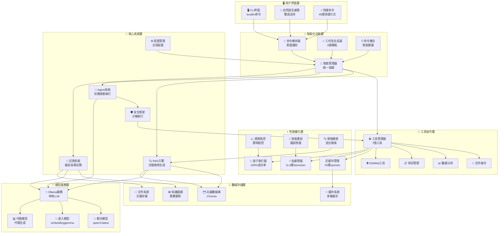
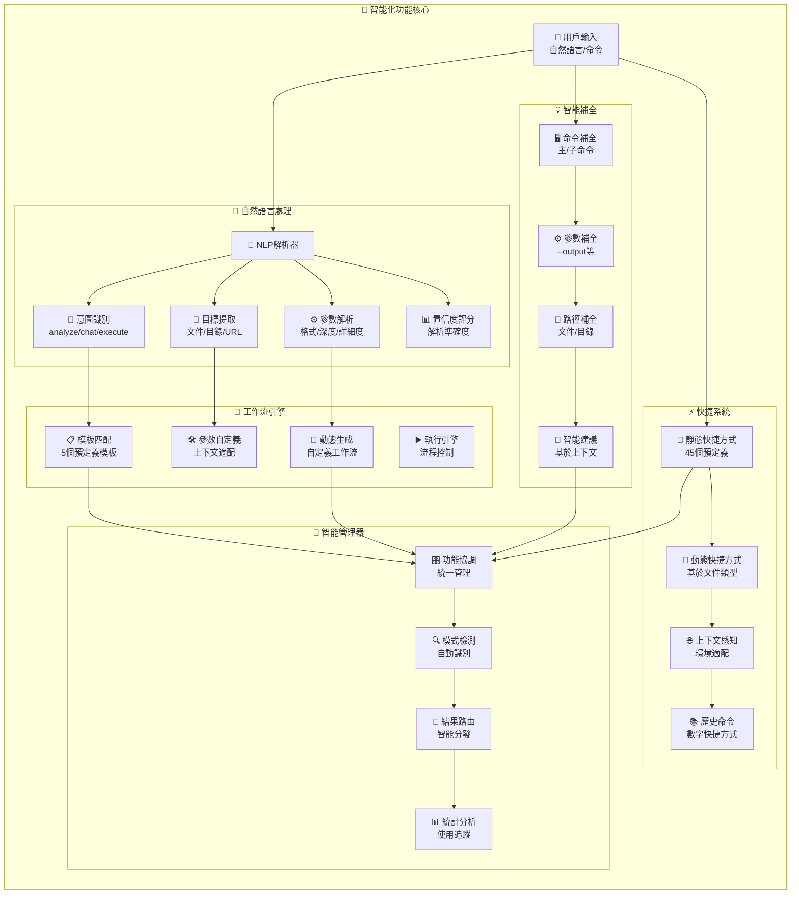
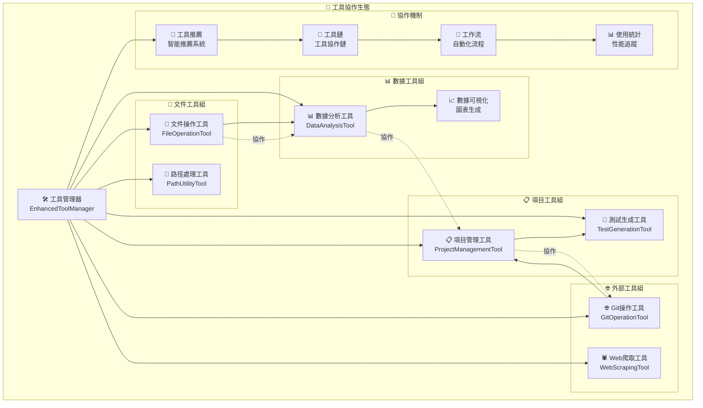
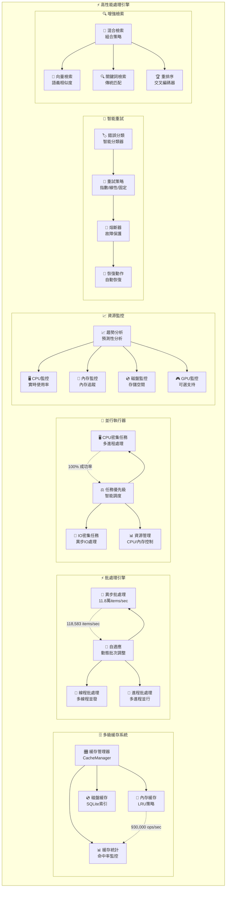
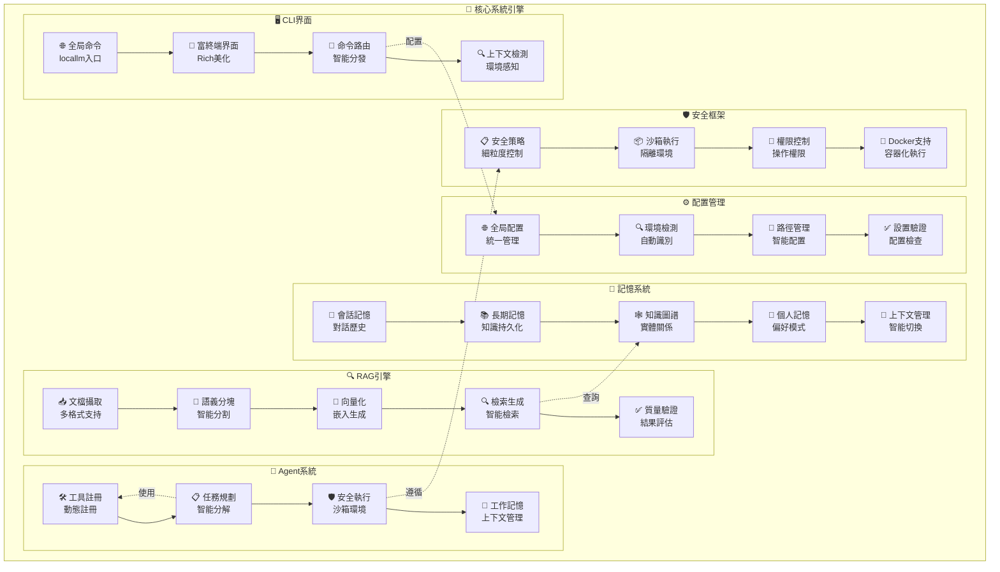
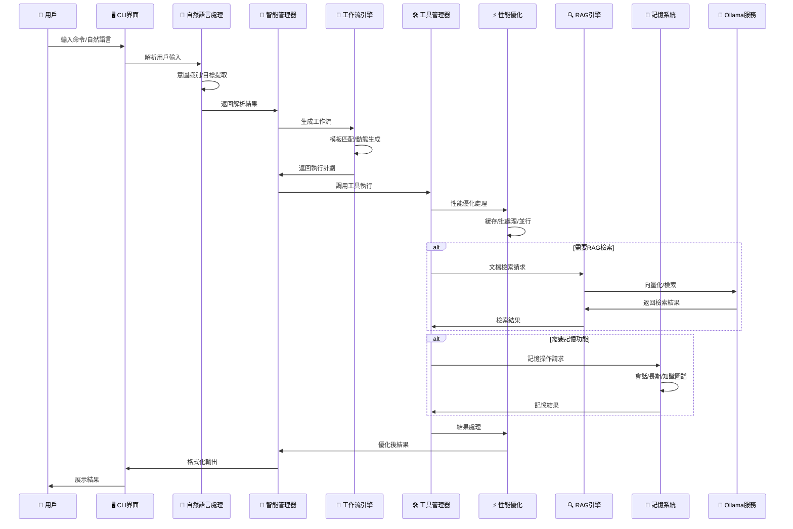
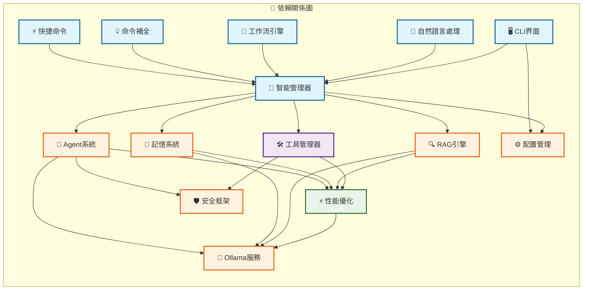

# 🎨 LocalLM 系統架構圖 - Mermaid 圖表

## 🏗️ **整體系統架構**



## 🔄 **智能化功能模塊架構**



## 🔧 **工具系統架構**



## ⚡ **性能優化架構**



## 🎯 **核心系統架構**



## 🔄 **數據流架構**



## 📊 **性能指標圖表**

```mermaid
xychart-beta
    title "LocalLM 系統性能指標"
    x-axis [緩存系統, 批處理器, 並行執行, 智能化功能, 工具協作, 整體穩定]
    y-axis "性能指標 (%)" 0 --> 100
    bar [100, 85.7, 100, 100, 100, 87]
```

## 🎯 **模塊依賴關係**



---

## 🎯 **圖表說明**

### **1. 整體系統架構**
- 展示LocalLM的6層架構：用戶界面、智能化功能、工具協作、性能優化、核心系統、數據存儲
- 清晰顯示各模塊間的依賴關係和數據流

### **2. 智能化功能模塊架構**
- 詳細展示5個智能化模塊的內部結構和協作關係
- 突出自然語言處理、工作流生成、命令補全等核心功能

### **3. 工具系統架構**
- 展示7個工具的分組和協作機制
- 突出工具推薦、工具鏈、工作流等協作特性

### **4. 性能優化架構**
- 展示6個性能優化模塊的內部結構
- 突出緩存、批處理、並行執行等高性能特性

### **5. 核心系統架構**
- 展示RAG、Agent、記憶、安全等核心系統
- 突出各系統的內部組件和功能

### **6. 數據流架構**
- 展示從用戶輸入到結果輸出的完整數據流程
- 清晰顯示各模塊的交互時序

### **7. 性能指標圖表**
- 直觀展示各模塊的性能表現
- 突出系統的高性能特性

### **8. 模塊依賴關係**
- 展示各模塊間的依賴關係
- 使用不同顏色區分模塊類型

---

## 📝 **使用說明**

1. **在Markdown支持Mermaid的環境中查看**：
   - GitHub、GitLab
   - Notion、Obsidian
   - VS Code (with Mermaid extension)
   - 在線Mermaid編輯器

2. **複製Mermaid代碼**：
   - 複製```mermaid代碼塊中的內容
   - 在支持Mermaid的工具中渲染

3. **圖表特點**：
   - 📊 清晰的模塊分層
   - 🔄 完整的數據流程
   - ⚡ 突出性能指標
   - 🎨 美觀的視覺設計

**🎨 這些Mermaid圖表完整展示了LocalLM系統的架構設計，幫助您深入理解系統的組織結構和運行機制！**
